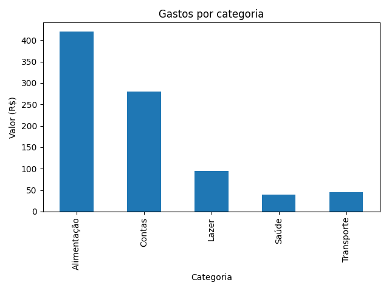

# 📊 Personal Finance Data Analysis

Projeto de Análise de Dados desenvolvido em Python com foco em exploração, tratamento e visualização de dados financeiros.

## 🎯 Objetivo
Analisar gastos pessoais a partir de um arquivo CSV, identificar padrões de consumo e gerar insights por categoria.

## 🛠 Stack
Python · Pandas · Matplotlib · Git

## 📈 Principais análises
- Cálculo do total de despesas
- Agrupamento e soma por categoria
- Visualização em gráfico de barras

## 📊 Visualização

